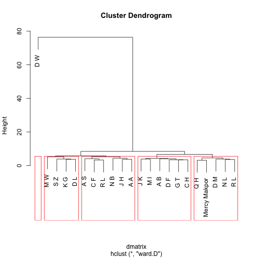

<style>

.reveal section p {
  color: black;
  font-size: .7em;
  font-weight: normal;
  font-family: 'Helvetica'; #this is the font/color of text in slides
}


.section .reveal .state-background {
    background: white;}
.section .reveal h1,
.section .reveal p {
    color: black;
    position: relative;
    font-family: 'Helvetica';
    font-weight: normal;
    top: 4%;}
   
 
 /* section titles */
.reveal h1 { 
  color: black;
  position: relative;
  font-weight: normal;
  font-family: 'Helvetica'; 
  top: 4%
}    

 
/* slide titles */
.reveal h3 { 
  color: black;
  font-weight: normal;
  font-family: 'Helvetica'; 
}    

.small-code pre code {
  font-size: 1.2em;
}

</style>


Research Speed Dating
========================================================
author: Chris Bail, 
date: SICSS
autosize: true
transition: none

========================================================

# **STRENGTHS OF GROUP PROJECTS**


1. Better Science
========================================================

1. Better Science
========================================================


1. Better Science
========================================================


2. This may be especially true for CSS
========================================================


2. This may be especially true for CSS
========================================================


3. Group Projects may be the Most Efficient Way for us to Learn from Each Other
========================================================


========================================================

# **CHALLENGES OF GROUP PROJECTS**


Challenges
========================================================
&nbsp; 

1. Tremendous diversity of skills  
2. Ensuring good group chemistry 
3. Limited time 
4. Different goals?
5. Free-riding


SICSS Group Projects
========================================================
&nbsp; 

1. Can take on many forms (from original empirical reseaarch to creation of open-source tools)
2. In one week, many groups will only find enough time to create a proposal, though some may have pilot results by the end of the week.
3. We run a special grant program for SICSS participants via the Social Science Research Council where you can apply for funding about 1.5 months after our event.  

========================================================

# **RESEARCH SPEED DATING**


Research Speed-dating
========================================================
&nbsp;  

1. We crowdsource a list of research interests in a google doc (5 min)
2. Each person writes a "1" next to their research interests (5 min)
3. We identify maximally similar clusters of participants
4. We identify maximally different clusters of participants

Research Speed-dating
========================================================
&nbsp;  

1. Maximally similar clusters come up with a group project (75 min)  
2. Maximally different clusters come up with a group project (75 min)  
3. We start a new google doc. Each person takes 5 minutes to write down their favorite group project idea  
4. Everyone puts their name next to the group project they want to join  


Research Speed-dating
========================================================
&nbsp;  

1. Have lunch today with your group in order to begin discussing your project.  
2. It is ok to change groups until the end of today.


Timeline for this week
========================================================
&nbsp;

Monday: develop group project ideas and make research teams

Tuesday: work on group projects

Wednesday-Thursday: work on group projects  

Friday (afternoon): group presentations (with feedback)


========================================================

# **LET'S BEGIN**


Let's crowdsource a list of our research interests
========================================================
&nbsp;

Place the name of a research interest in the first column of this
document, and write a "1" across all research interests you have:

https://tinyurl.com/SICSSSpeedDating2021


Read the Googlesheet
========================================================
class: small-code 
&nbsp;


Identify Maximally similar
========================================================
class: small-code 
&nbsp;




Simulate Random Groups
========================================================
class: small-code 
&nbsp;


```
[1] 1
[1] 2
[1] 4
[1] 5
[1] 8
[1] 10
[1] 20
[1] 25
[1] 40
[1] 50
[1] 100
[1] 125
[1] 200
[1] 250
[1] 500
[1] 1000
```

Identify maximally diverse groups
========================================================
&nbsp;


```
                       names diversity_score
29           N L,R L,C H,M W        4.779123
93           R L,A B,D F,M W        4.779123
321          M I,D F,N L,R L        4.770685
480          A B,N L,M W,K G        4.770685
957          A B,C H,M W,N L        4.770685
250          N L,A B,D F,M I        4.762174
260          D M,N L,R L,M W        4.762174
400          N L,M W,N B,R L        4.762174
610 M W,M I,N L,Mercy Makpor        4.762174
939          R L,N L,M W,N B        4.762174
```


Go!
========================================================
&nbsp;

Meet in maximally similar and dissimilar groups for 75 minutes. Site organizer will create googlesheet where project ideas will be listed. At the end of each 75 minutes period, one group representative should write the name of the project and a brief (less than three sentence description). After the end of the exercise, put your name next to the research project that you are most excited about joining. Click on the link to the google doc for your site here: https://tinyurl.com/SICSSSpeedDating2021 
